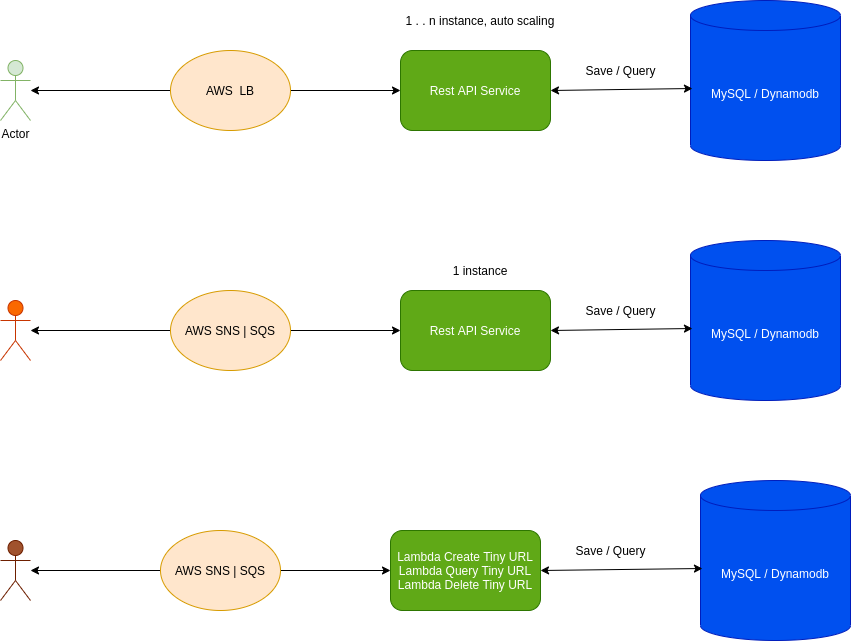
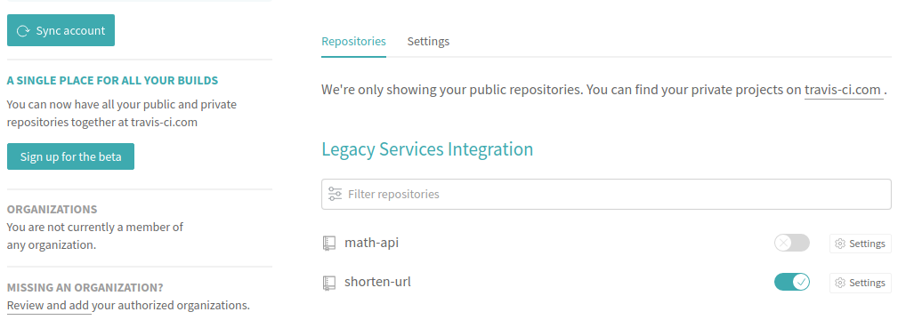
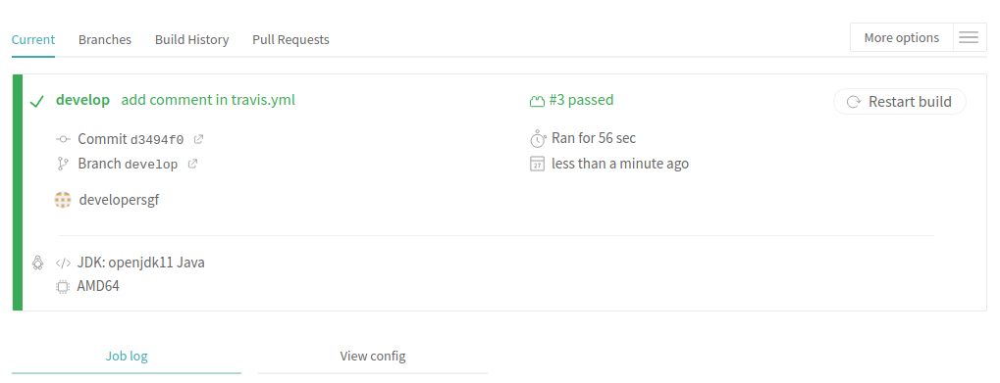
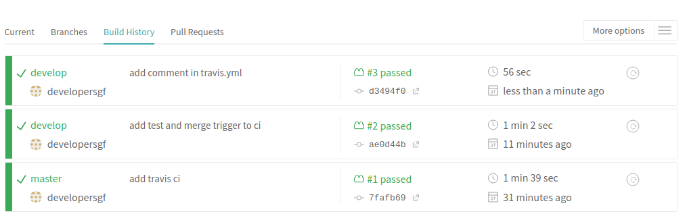
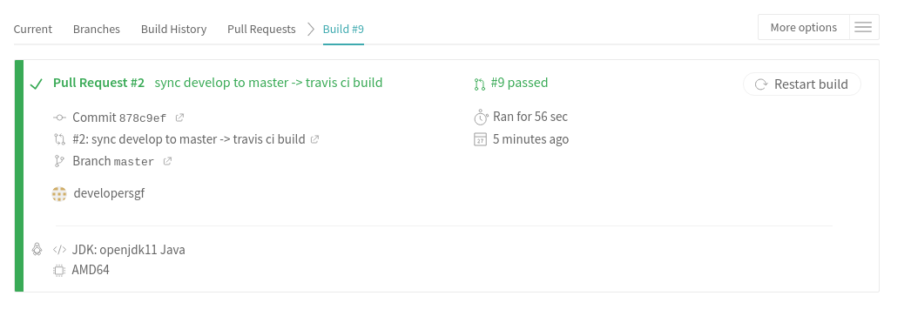

# Spring Boots Demo - Shorten URL

## System requirement
    JDK 11
    h2 database
    Spring boot
    Docker 
    Minikube

## System Design
- 
- `Hashing.murmur3_32()`: murmur Hash is one of the best hash algorithms which trade-off between hash performance and hash conflict rate 

### Local running
1. `mvn clean install -DskipTests=true spring-boot:run`
1. `mvn clean install -DskipTests=true`
1. `mvn clean install`

### Docker running
    docker rm $(docker ps -aq)
    mvn clean package docker:build -Dmaven.test.skip=true
    mvn clean package docker:build
    docker-compose -f ./target/docker/docker-compose.yml up
    docker exec -it <container_id> sh

## Run the application
- After running, access the api doc and db by the following link
    1. http://localhost:8080/swagger-ui/
    1. http://localhost:8080/h2-console

## CI - Travis CI
    Create account in `https://travis-ci.com` and grant Authority to Travis CI
    Sync account
    Trigger build

  - 
  - 
  - 
  - 

Migrate docker or kubernetes application, AWS `EKS` `ECS` is a good approach.  